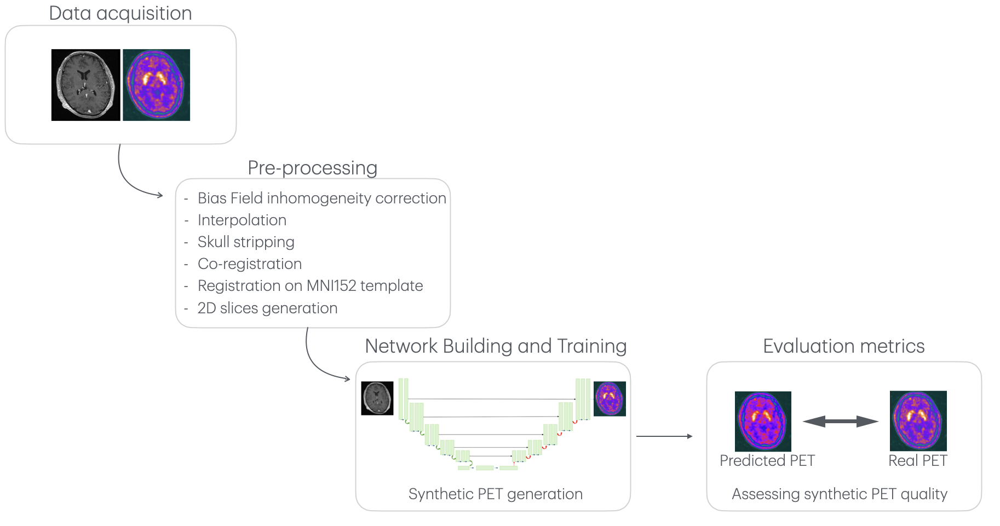

# 🧠 Synthetic PET Image Prediction from MR Scans in Brain Tumors: A Deep Learning Approach using a ResU-Net Architecture

📌 Project Overview
Positron Emission Tomography (PET) and Magnetic Resonance Imaging (MR) provide complementary information for the management of brain tumors.
MR scans → structural insights
PET scans → metabolic activity
However, PET is costly, less accessible, and may delay patient screening.
👉 Our goal: generate synthetic PET images from MR scans using Deep Learning.

🧹 Data Cleaning & Preprocessing
- MRI bias correction (N4) to reduce intensity inhomogeneity.
- Resampling MRI & PET to 1 mm³ voxels for uniform resolution.
- Skull stripping (ANTs) to remove non-brain tissue.
- Registration: PET → MRI + normalization to MNI152 space.
- 2D slicing: 182×218 axial slices, discarding low-info edges → 10,824 MR–PET pairs.

👉 Adopted 2D slices to cut computational cost and reduce overfitting.

⚙️ Deep Learning Model: ResU-Net
- Encoder–decoder U-Net backbone with residual connections
- Skip connections to preserve spatial features
- Optimized for image-to-image translation (MR → PET)
- Loss function: MSE + MAE (to reduce blurriness)
- Training monitored with ReduceLROnPlateau scheduler

📊 Results
Evaluated against ground-truth PET using standard image quality metrics.
Metric:Score
- SSIM:0.97
- PSNR:31.55
- MAE:0.010
- MSE:0.0007

✔️ Synthetic PET images show strong similarity to real PET scans.

🚀 Key Contributions
Novel application of ResU-Net for PET synthesis in brain tumors
Rigorous data cleaning & preprocessing pipeline
Robust validation with 10-fold cross-validation
Quantitative evidence that deep learning can reduce dependency on costly PET scans

